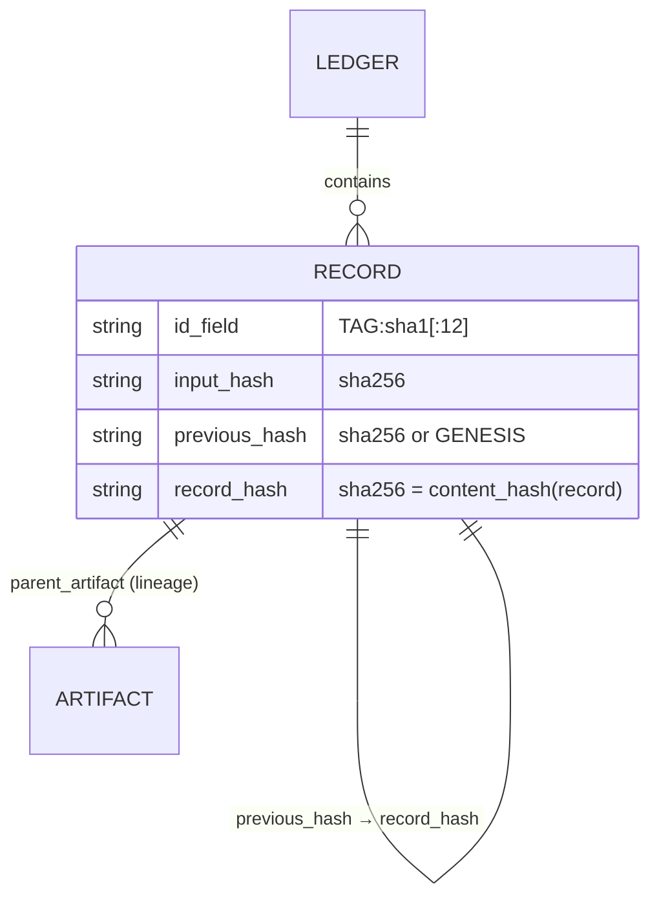
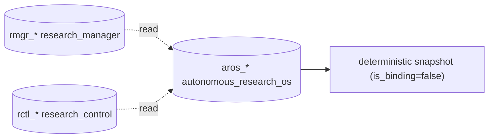
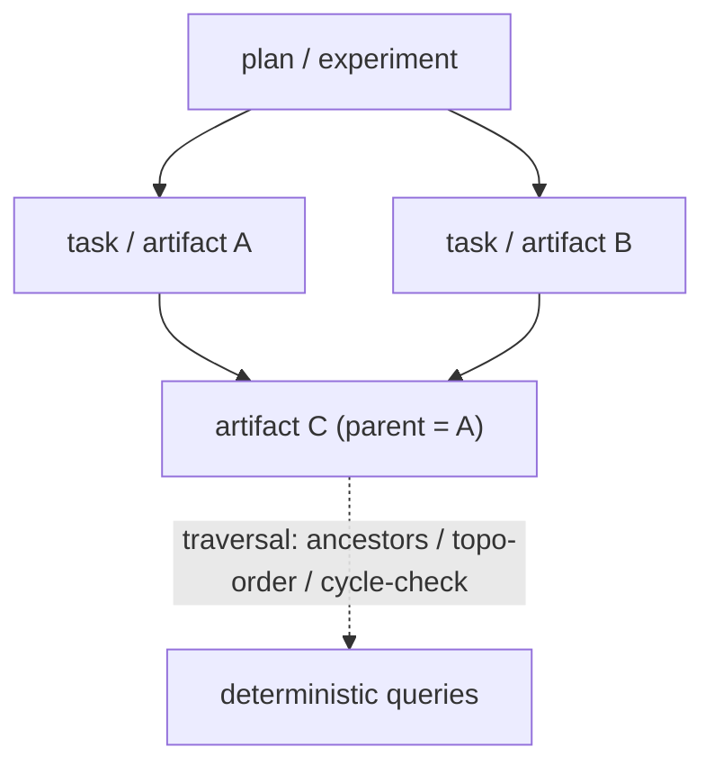

# Diagram — Entity Relationships, Ledgers & Knowledge Graph

## Ledger record & hash chain (entity relationships)

## Ledger relationships (read-only cross-layer)

## Knowledge graph & lineage

## Notes

Provenance lives in the ledgers themselves via `parent_artifact` links; `jarvis.integrity`
verifies chains and lineage, and `jarvis.diagnostics` flags broken lineage. See
`documentation/architecture/ledger-ownership-map.md` and
`documentation/adr/0007-knowledge-graph.md`.
