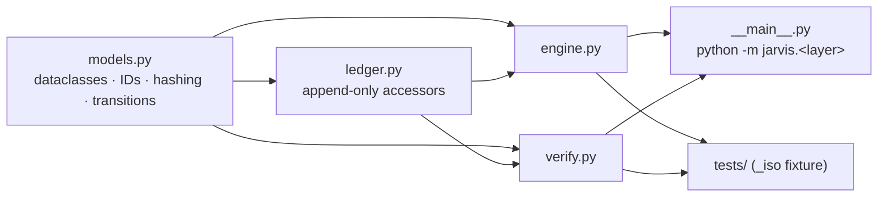
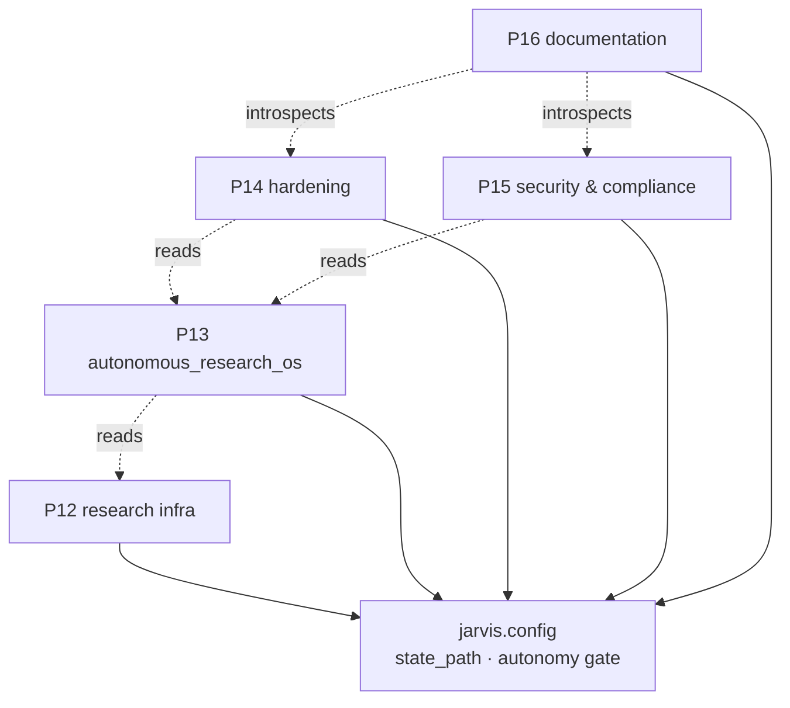

# Diagram — Package Hierarchy & Layer Dependency

## Package hierarchy (inside a layer)

## Layer dependency (across the stack)

## Notes

- All layers depend only on the shared `jarvis.config` core and the standard library.
- Cross-layer arrows are **data reads**, not import-level coupling — no upward imports, no
  cross-layer mutation. See `documentation/architecture/dependency-map.md`.
