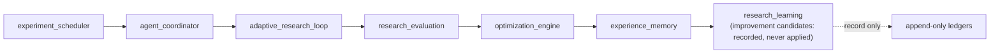
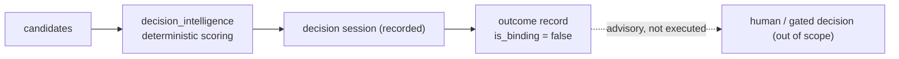
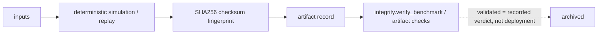

# Diagram — Automation, Decision & Simulation Pipelines

## Automation flow (autonomous research pipeline)

## Decision pipeline

## Simulation pipeline

## Notes

Every stage only observes, analyzes, and records. No stage places orders or deploys. See
`documentation/adr/0008-automation-pipeline.md`, `documentation/adr/0010-decision-intelligence.md`,
and `documentation/adr/0011-simulation-environment.md`.
