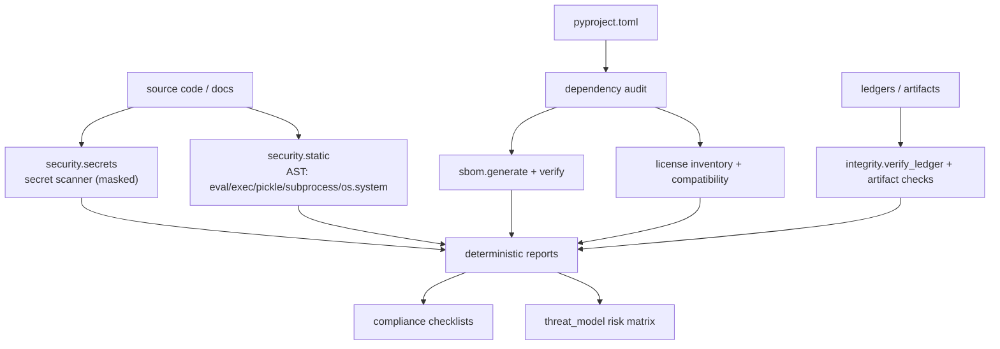
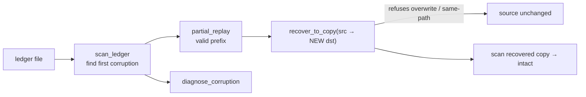

# Diagram — Security Model & Recovery Flow

## Security model (P15, read-only)

## Recovery flow (P14 resilience, originals immutable)

## Notes

All security and recovery tools are read-only over the data they inspect; recovery writes only
to a new file. See `documentation/adr/0009-security-architecture.md` and
`documentation/architecture/read-only-boundaries.md`.
