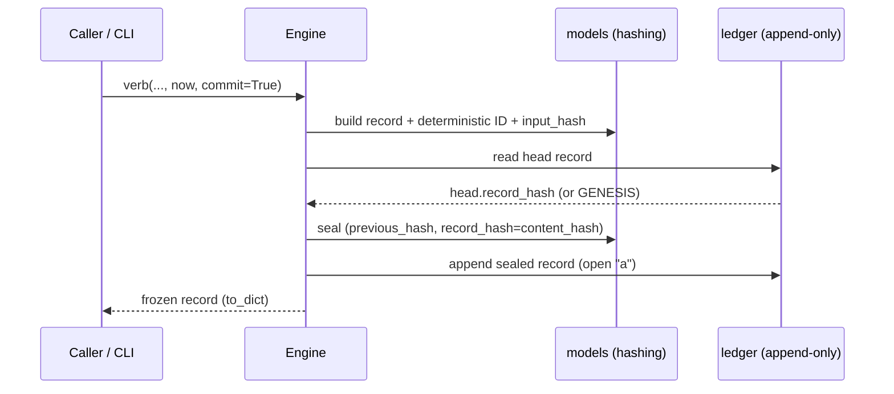
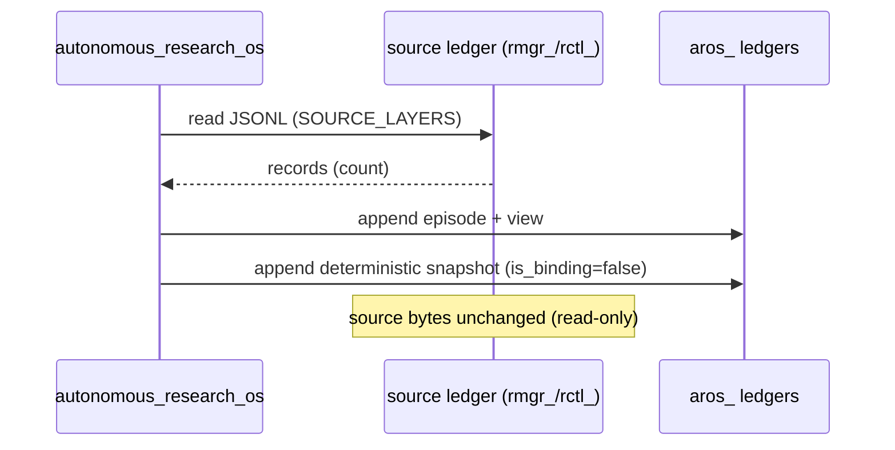
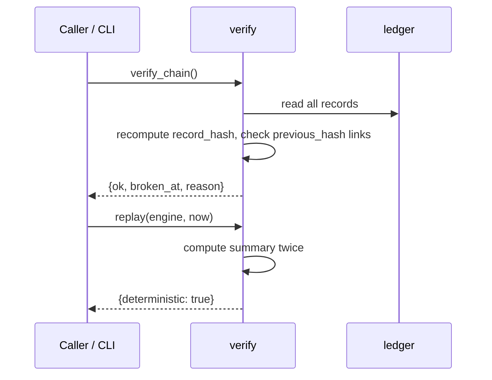

# Diagram — Sequence Diagrams

## Committing a record (write path)

## Read-only observation (Research OS)

## Verification & replay

## Notes

These sequences apply uniformly across layers because they all share the ledger substrate. See
`documentation/architecture/data-flow.md`.
