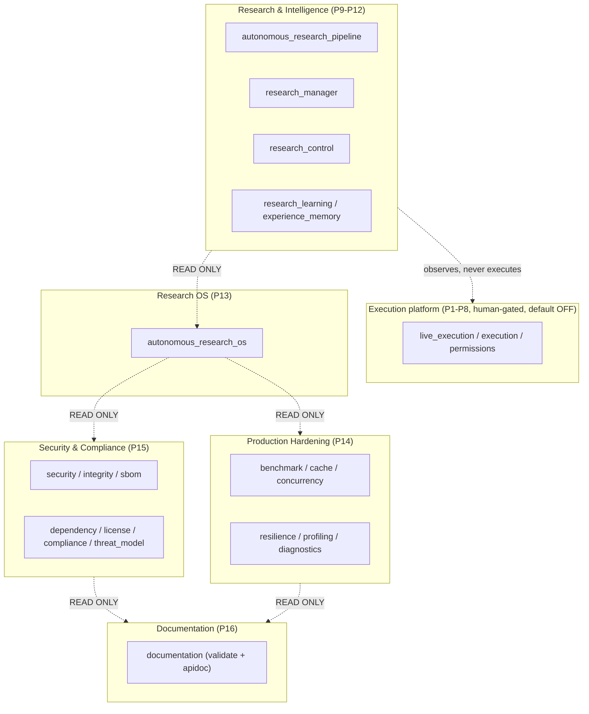

# Diagram — System Architecture

High-level view of the Autonomous Quant Research OS: additive research layers observing an
execution platform they never touch.

## Reading the diagram

- Solid boxes are additive layer families; dotted arrows are **read-only** observations.
- The research stack observes the execution platform but has no path to execute it.
- Every higher family reads lower families read-only and writes only its own ledgers.

See `documentation/architecture/overview.md` for the narrative.
